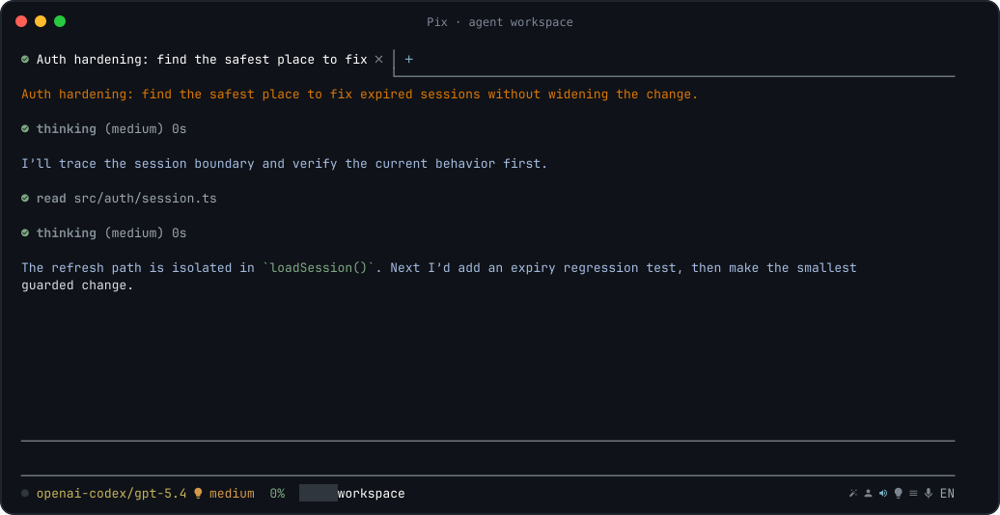
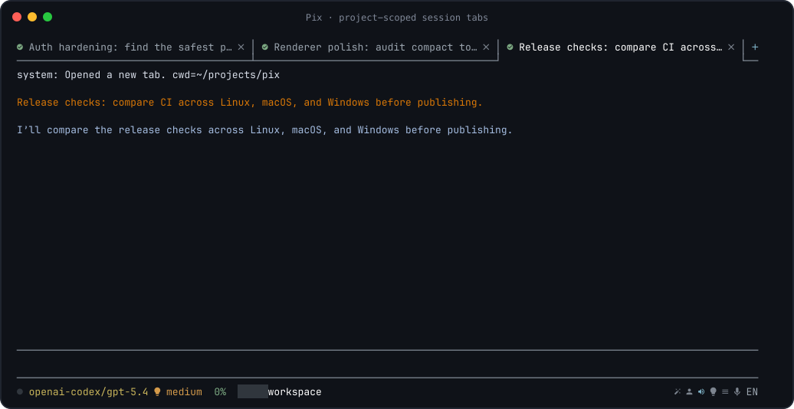
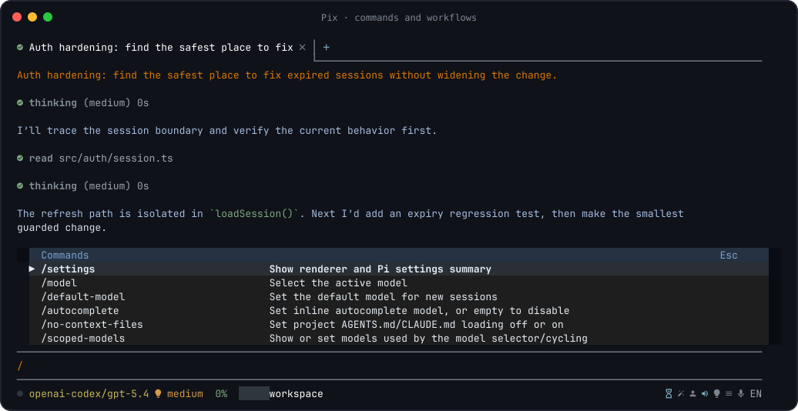
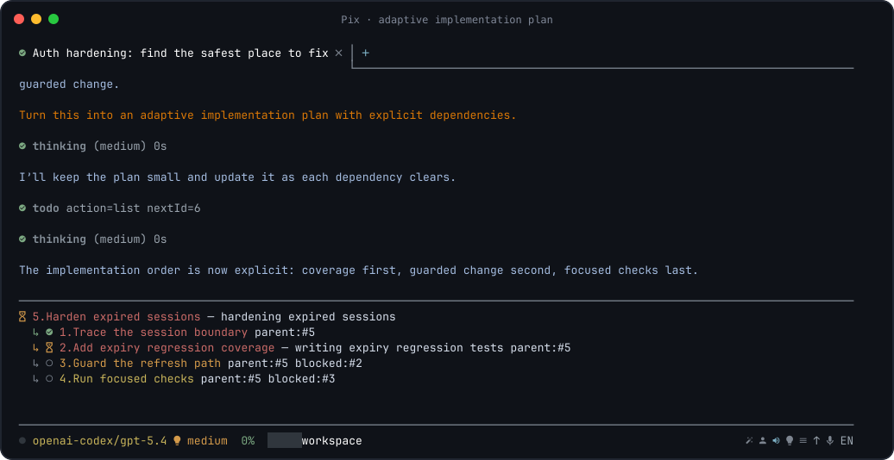
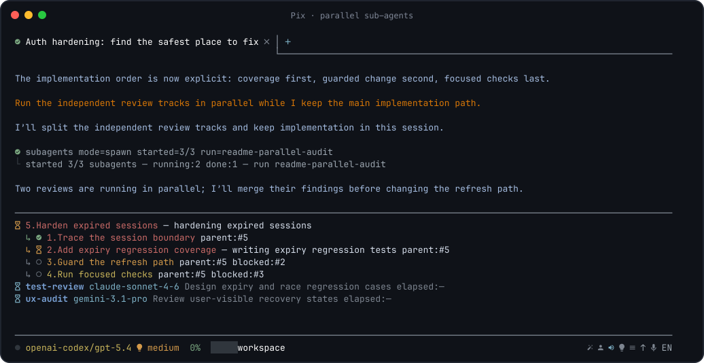

<div align="center">

# Pix

**A workspace-first terminal UI for [Pi](https://github.com/badlogic/pi-mono) — built for real coding sessions, not terminal log archaeology.**

Tabs, readable tool activity, session navigation, local voice input, an interactive shell, and a bundled toolkit for repository-scale agent work.

[](https://www.npmjs.com/package/pi-ui-extend)
[](https://www.npmjs.com/package/pi-ui-extend)
[](https://github.com/dnaroid/pix/actions/workflows/check.yml)
[](#requirements)

</div>



## Start in two commands

```bash
npx pi-ui-extend install
npx pi-ui-extend --cwd .
```

The setup command checks the icon font, the `pi` CLI, and clipboard support. The second command opens the current project in Pix without requiring a global Pix install.

> Already installed globally? Run `pix --cwd .`.

## Why Pix?

Pi provides the agent runtime, models, tools, skills, extensions, and persistent sessions. Pix keeps that SDK-native foundation and replaces the stock interface with a renderer designed around long, tool-heavy coding work.

- **See the work, not the noise.** Thinking and tool calls are compact rows that expand on demand. Mutating tools, searches, failures, todos, and sub-agents are visually distinct.
- **Keep projects organized.** Tabs are scoped to the working directory and survive restarts. Search, resume, fork, clone, jump through, import, export, share, or delete sessions without leaving the terminal.
- **Stay in flow.** Run quick commands with `!`, open a raw interactive terminal with `!!`, paste images, follow file links, dictate in English or Russian, and improve a prompt before sending it.
- **Know what the agent is doing.** The status area exposes model, thinking level, context, usage, workspace, todos, sub-agents, voice state, and prompt actions — with mouse targets where useful.
- **Bring a serious toolkit.** Pix ships with `pi-tools-suite`: 17 integrated modules for indexed repository discovery, AST edits, LSP diagnostics, parallel agents, durable todos, context compression, web access, provider accounts, and more.
- **Use the models you want.** Pix runs on Pi's provider ecosystem and supports model switching, scoped model lists, per-model thinking levels, usage views, autocomplete, and fallback-aware helper workflows.

Pix is not a separate agent protocol or an RPC wrapper around Pi. It runs on the Pi SDK, so the runtime, session format, extensions, skills, prompts, and tools remain part of the same ecosystem.

## The interface

### A workspace, not a transcript

- **Persistent tabs** for independent tasks in the same project.
- **Lazy session loading** so restoring a workspace does not eagerly start every runtime.
- **Compact activity rows** with configurable previews, colors, expansion, and output filtering.
- **Dedicated todo and sub-agent panels** instead of dumping orchestration state into chat.
- **Mouse-aware navigation** for tabs, status actions, scrolling, expandable blocks, menus, links, and the scrollbar.
- **Rich terminal content** including Markdown, code blocks, diffs, file links, images, toasts, widgets, dialogs, and custom extension UI.
- **Dark and light themes**, configurable model colors, and Nerd Font icons with graceful fallbacks.



### Commands are searchable

Type `/` to open the command picker. Continue typing to filter built-in commands and commands contributed by extensions.



### Agent activity stays readable

Pix gives different kinds of work different visual weight:

- thinking can remain collapsed until you need it;
- reads and searches show concise previews;
- edits and patches are expanded by default;
- long shell output can show its tail while the command runs;
- failures remain visible;
- tool rows can be expanded or collapsed with the mouse;
- todo and sub-agent state is rendered as structured UI.

All of this is configurable per exact tool name or wildcard such as `repo_*` and `ast_*`.

**Adaptive plans keep dependencies, blockers, ownership, and the active step visible:**



**Parallel sub-agents report live status without taking over the main session:**



## Bundled: pi-tools-suite

On startup, Pix tries to link the bundled suite into the active Pi agent directory (normally `~/.pi/agent/extensions/pi-tools-suite`). An existing non-symlink installation is preserved. Suite modules are designed to work without Pix-specific UI where they are loaded; suite-spawned sub-agents intentionally use an isolated, minimal extension set.

| Capability | Included modules | What it adds |
| --- | --- | --- |
| Parallel work | `async-subagents` | Isolated asynchronous agents, presets, model fallback routing, result artifacts, `/ultrawork`, and `/hyperplan`. |
| Repository intelligence | `repo-discovery` | Indexed architecture, structure, AST, semantic search, symbol explanation, and dependency/caller tools when the repository has an `.indexer-cli` index. |
| Structural code changes | `ast-grep` | Language-aware AST search, rewrite previews, and explicit AST mutation tools. |
| Fast feedback | `lsp`, `comment-checker` | Project-trusted language-server diagnostics and a guard against low-quality AI-style code comments. |
| Durable planning | `todo` | Hierarchical todos with blockers, owners, persistence, scoped resumes, and per-task thinking levels. |
| Context control | `dcp` | Explicit compression and context pruning for long sessions, including sidecar state. |
| Local web access | `web-search` | Web search and page extraction through a local Ollama instance. |
| Providers and quotas | `antigravity-auth`, `opencode-import`, `usage` | Antigravity OAuth/account failover, OpenCode credential import, and multi-provider usage views. |
| Reusable workflows | `prompt-commands`, `skill-installer`, `session-name` | Prompt-command CRUD, skill installation/export, and session naming. |
| Model compatibility | `coding-discipline`, `model-tools`, `codex-reasoning-fix` | Model-specific discipline and vision lookup, compatibility aliases, and a Codex reasoning payload workaround. |

Every module can be disabled. Optional integrations only activate when their requirements are available — for example, repository tools require an index, web tools require local Ollama web search, and LSP servers must be configured and trusted.

Suite configuration is loaded from:

1. `~/.config/pi/pi-tools-suite.jsonc`
2. `$PI_CONFIG_DIR/pi-tools-suite.jsonc`, when set
3. the nearest project `.pi/pi-tools-suite.jsonc`

Later files override earlier ones. Disable modules with `disabledModules`, `PI_TOOLS_SUITE_DISABLED_MODULES`, or disable the entire suite with `PI_TOOLS_SUITE_DISABLED=1`. DCP settings are intentionally user-scoped and belong in the shared user configuration.

## What you can build with it

| Workflow | Pix advantage |
| --- | --- |
| Explore an unfamiliar repository | Start with an indexed architecture map, search behavior semantically, inspect symbols, and trace dependencies without flooding context with entire files. |
| Run a large refactor | Combine repository discovery, AST-aware changes, LSP feedback, workspace undo, and a structured todo plan. |
| Investigate several hypotheses | Launch focused sub-agents in parallel, keep working, and inspect compact result artifacts when they finish. |
| Carry a task across many sessions | Persist tabs and todos, search session history, fork from an earlier message, and compress old context without losing the active objective. |
| Work across providers | Switch models and thinking levels, scope the model picker, import supported accounts, inspect quotas, and use fallback-aware sub-agent presets. |
| Keep your hands in the terminal | Run quick shell commands inline, use a full interactive TTY when needed, paste images, dictate prompts, and open file links directly. |

## Install

### Requirements

- **Node.js `>=22.19.0 <25`**
- macOS, Linux, or Windows terminal with 256-color support
- npm or another way to run the published npm package
- provider credentials supported by Pi, unless you only use locally configured models

Recommended:

- **JetBrainsMono Nerd Font** for the intended icons; `pix install` can install it for the current user
- a terminal with mouse reporting and Kitty keyboard protocol support for the richest interaction
- Linux clipboard helper: `wl-clipboard` on Wayland or `xclip`/`xsel` on X11

Optional:

- the `vosk` optional dependency for local voice input
- an audio recorder for dictation: SoX (`rec`/`sox`), `ffmpeg`, or `arecord` on Linux
- `tmux` and `rsvg-convert` only if you want to regenerate README screenshots
- Ollama with web search enabled for the bundled `web_search` and `web_fetch` tools
- language servers for the LSP module

### One-shot use

```bash
# Check/install runtime helpers for this user
npx pi-ui-extend install

# Start Pix in a project
npx pi-ui-extend --cwd /path/to/project
```

### Global install

```bash
npm install -g pi-ui-extend --ignore-scripts
pix install
pix --cwd /path/to/project
```

The package exposes both `pix` and `pi-ui-extend`; they launch the same application.

### Check without changing anything

```bash
npx pi-ui-extend install --check
# or, after a global install
pix install --check
```

### Start options

```text
pix [--cwd <path>] [--no-session] [--session <path>]
    [--theme dark|light] [--model <provider/model[:thinking]>]
```

Examples:

```bash
pix --cwd .
pix --cwd ../pi-mono --theme light
pix --cwd . --model anthropic/claude-sonnet-4-20250514:medium
pix --cwd . --no-session
```

## Models and accounts

Pix uses Pi's model and authentication stores. Environment-based API keys and credentials already configured for Pi are available to Pix.

- Run the stock `pi` TUI when you need its provider login/logout dialogs, then use `/reload` in Pix.
- Run `/opencode-import` to import supported credentials from OpenCode.
- Run `/antigravity-add-account` to add an Antigravity OAuth account, then use `/antigravity-account` and `/antigravity-status` to manage it.
- Use `/model`, `/scoped-models`, and `/thinking` to control the active runtime.
- Use `/default-model`, `/default-thinking`, and `/autocomplete` to change defaults for new sessions.
- Use `/usage` or the clickable usage status to inspect locally available quota data.

Provider availability and thinking levels depend on the selected model. Pix does not upload private repository data merely to populate the model or usage UI; normal model requests still follow the provider you choose.

## Everyday interaction

### Prompts

- **Enter** sends the current prompt.
- **Shift+Enter** inserts a newline.
- **Tab** accepts autocomplete or the selected popup item.
- `/enhance` — or the status-bar magic wand — improves the current draft with the configured helper model.
- `/queue <message>` stores a delayed message you can send later from the queue menu.
- Prompt history is searchable with `/history` and navigable with Up/Down when no popup owns those keys.

Pix can provide inline, model-backed autocomplete with configurable debounce, timeout, token budget, and recent-message context.

### Local shell

```text
!git status
!npm test
!!npm run dev
!!python
```

- `!command` runs a shell command and renders the result in chat. It is local UI activity and is not saved to the Pi session.
- While it runs, submit editor text to its stdin; use `Ctrl-C` to interrupt.
- `!!command` opens a raw interactive terminal for REPLs, TUIs, debuggers, and development servers. Exit it to return to Pix.

### Images, clipboard, and files

- Paste an image from the clipboard with `Ctrl+V`/`Cmd+V` in supported terminals.
- Add image/file references to prompts and open detected file links from rendered output.
- `/copy` copies the last assistant message.
- Pix integrates with the native clipboard on macOS and Windows and common Wayland/X11 helpers on Linux.

### Local voice input

Press `Ctrl+G` or click the microphone in the status area to start/stop dictation. Pix supports configurable local Vosk models and ships defaults for:

- English: `vosk-model-small-en-us-0.15`
- Russian: `vosk-model-small-ru-0.22`

The selected model is downloaded on first use. Recognition is local; the resulting text is inserted into the editor so you can review it before sending.

### Workspace undo

Pix records supported agent file mutations against the user message that started them. Open that message's action menu and choose **Undo changes** to rewind the session branch and restore the recorded workspace changes. It is a safety net, not a replacement for version control.

## Sessions and tabs

Pix stores a tab workspace per working directory. Reopening the same `--cwd` restores its tabs, active tab, drafts, queued messages, and session references.

- `/new_tab` opens a fresh session without replacing the current tab.
- `/resume` opens a session picker or accepts a session path.
- `/search` searches session contents and opens a match in a new tab.
- `/fork`, `/clone`, `/tree`, and `/jump` support branching and navigation inside session history.
- `/export` writes HTML by default or JSONL when given a `.jsonl` path.
- `/import` resumes a JSONL session; `/share` publishes a secret GitHub gist.
- `/compact` manually summarizes older context; the DCP suite module provides finer-grained context compression.
- `/delete` permanently removes a session and its DCP sidecar after confirmation.

Set `maxProjectSessions` in Pix configuration to prune old session files automatically for each project; `0` keeps them indefinitely.

## Command reference

Type `/` for the live, searchable list. Extensions can add more commands than the core set below.

| Area | Commands |
| --- | --- |
| Renderer and resources | `/settings`, `/hotkeys`, `/reload`, `/changelog`, `/update` |
| Models | `/model`, `/default-model`, `/scoped-models`, `/thinking`, `/default-thinking`, `/autocomplete` |
| Project context | `/no-context-files`, `/compact` |
| Prompt workflow | `/enhance`, `/queue`, `/copy` |
| Sessions | `/new`, `/new_tab`, `/resume`, `/name`, `/session`, `/search`, `/history`, `/jump`, `/tree` |
| Branching and files | `/fork`, `/clone`, `/delete`, `/export`, `/import`, `/share` |
| Status | `/usage` |
| Process | `/quit`, `/exit` |

Useful suite commands include `/todos`, `/todos-persist`, `/todos-scope`, `/sub-status`, `/sub-stop`, `/ultrawork`, `/hyperplan`, `/subagent-preset`, `/usage`, `/dcp`, `/idx-init`, `/idx-update`, `/opencode-import`, `/antigravity-add-account`, `/install-skill`, and `/export-skill`.

### Keyboard and mouse

| Input | Action |
| --- | --- |
| `Enter` | Send a message or run the selected command |
| `Shift+Enter` | Insert a newline |
| `Tab` | Accept autocomplete / selected popup item |
| `Esc` | Close a popup or abort running work |
| `Up` / `Down` | Navigate history or the active popup |
| `PageUp` / `PageDown` | Scroll the conversation by page |
| `Cmd+Up` / `Cmd+Down` | Alternative page scrolling in supported terminals |
| `Ctrl+C` | Interrupt running work; press again while an abort is in progress to stop Pix |
| `Ctrl+D` | Quit when the editor is empty |
| `Ctrl+L` | Redraw the screen |
| `Ctrl+G` | Toggle voice recording |
| `Ctrl+V` / `Cmd+V` | Paste a clipboard image when supported |
| Mouse wheel / scrollbar | Scroll the conversation or active popup |
| Click | Switch tabs; expand activity; follow links; activate visible status actions |

Use `/hotkeys` for the authoritative in-app summary for your installed version.

## Configuration

Pix creates a commented JSONC file on first launch:

```text
~/.config/pi/pix.jsonc
```

A project can override it with:

```text
<workspace>/.pi/pix.jsonc
```

Both support the published schema:

```jsonc
{
  "$schema": "https://unpkg.com/pi-ui-extend/schemas/pix.json",
  "defaultModel": {
    "modelRef": "openai-codex/gpt-5.6-sol",
    "thinking": "medium"
  },
  "toolRenderer": {
    "default": { "previewLines": 0 },
    "tools": {
      "shell": { "previewLines": 6, "direction": "tail" },
      "repo_*": { "previewLines": 6, "direction": "head" },
      "apply_patch": { "defaultExpanded": true }
    }
  },
  "promptEnhancer": { "modelRef": "zai/glm-5-turbo" },
  "autocomplete": {
    "modelRef": "zai/glm-5-turbo",
    "debounceMs": 350,
    "timeoutMs": 3000
  },
  "dictation": { "language": "en" },
  "ignoreContextFiles": false,
  "maxProjectSessions": 0
}
```

Configurable areas include:

- default model and thinking level;
- scoped model selection and per-model colors;
- tool visibility, expansion, preview length/direction, and semantic colors;
- assistant output filters using globs or regex literals;
- autocomplete, prompt enhancement, and automatic session-title models;
- dictation languages and model download URLs;
- icon theme;
- loading of project `AGENTS.md`/`CLAUDE.md` files;
- per-project session retention.

Use `/settings` to inspect the effective settings summary and `/reload` after changing resources. Some command-driven settings update the relevant config file directly.

## Updates

```bash
# Check only
pix update --check

# Install the latest published Pix and align the global Pi CLI
pix update

# Reinstall even when the version appears current
pix update --force
```

Inside Pix, `/update` performs a check and explains the shell command needed for installation. Restart Pix after an update.

## Troubleshooting

### Icons look wrong

Run `pix install`, configure your terminal to use **JetBrainsMono Nerd Font**, and restart the terminal. Pix falls back to plain glyphs, but the intended UI uses Nerd Font icons.

### Clipboard images do not paste on Linux

Install `wl-clipboard` on Wayland or `xclip`/`xsel` on X11, then run `pix install --check`.

### Voice input is unavailable

Ensure the optional `vosk` dependency installed successfully, the configured model URL is reachable for its first download, and an audio recorder is available: SoX (`rec`/`sox`), `ffmpeg`, or `arecord` on Linux. Voice support can be omitted without affecting the rest of Pix.

### A provider login dialog is missing

Pix does not yet implement Pi's interactive `/login` and `/logout` dialogs. Authenticate in the stock `pi` TUI or configure the provider's supported environment/API-key storage, then run `/reload`.

### Repository discovery tools are absent

Those tools register only when Pix is launched from a repository with an `.indexer-cli` index. Run `/idx-init` to initialize the current repository, then `/reload`. If Pix was started elsewhere with `--cwd`, restart it from the project directory first:

```bash
cd /path/to/project
pix
```

`/idx-update` updates the globally installed `indexer-cli`; it does not refresh a project's index.

### An extension behaves differently

Pix supports Pi SDK extensions, including toasts, widgets, menus, dialogs, custom UI, and terminal input hooks. Extensions that assume private internals or a specific stock renderer may still need adaptation. Use `ctx.hasUI` guards for code that also runs headlessly.

## For extension authors

The package exports the renderer-facing SDK from both entry points:

```ts
import type { PixExtensionUIContext } from "pi-ui-extend";
// or
import type { PixExtensionUIContext } from "pi-ui-extend/sdk";
```

Pix implements the Pi extension UI surface for notifications, keyed toasts, widgets, above-input content, menus, dialogs, custom full-screen UI, editor text, terminal input hooks, theme helpers, and status updates. The published declarations are available in [`dist/sdk.d.ts`](dist/sdk.d.ts).

## Development

```bash
git clone https://github.com/dnaroid/pix.git
cd pix
npm install

# Run from source
npm run dev -- --cwd /path/to/project

# Typecheck and test
npm run check

# Validate the bundled suite
npm run test:tools-suite

# Build the publishable renderer
npm run build:pix
```

Regenerate the README screenshots without accounts or live model traffic:

```bash
node --import tsx scripts/capture-readme-screenshots.ts
```

The capture script runs the real renderer against the local test `MockModel` in an isolated tmux server and temporary home directory.

## Project layout

```text
src/                         Pix renderer and SDK bridge
external/pi-tools-suite/     bundled headless tools and extensions
schemas/                     published JSON schemas
skills/                      packaged agent skills
docs/                        release documentation
tests/                       unit, integration, and PTY tests
scripts/                     build, release, sync, and capture tooling
```

---

<div align="center">

**If your coding agent lives in the terminal, give it a workspace.**

```bash
npx pi-ui-extend --cwd .
```

</div>
