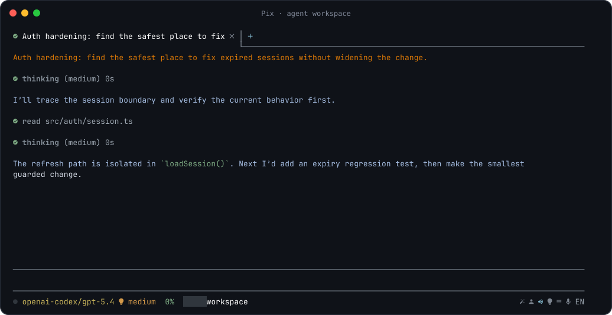
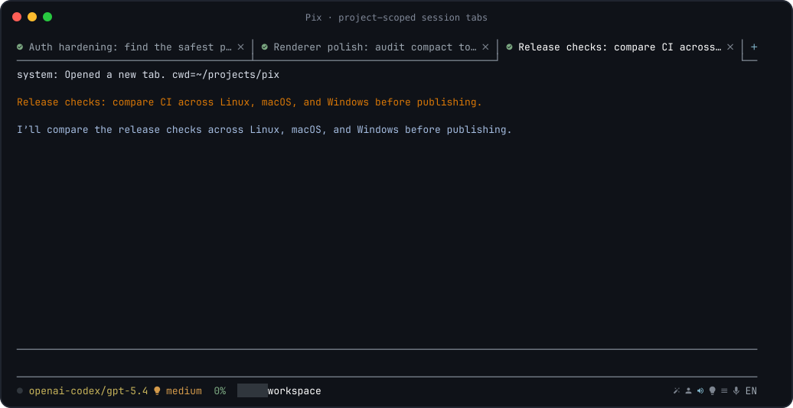

# Pix

**A workspace-first coding UI for [Pi](https://github.com/badlogic/pi-mono) —
available as a terminal TUI and a native Desktop app.**

Persistent workspaces, readable agent activity, project tools, Source Control,
repository intelligence, voice input and a bundled toolkit for serious coding
sessions.

[](https://github.com/dnaroid/pix/actions/workflows/check.yml)

<!-- markdownlint-disable MD013 -->



## Start

Download the latest **TUI** archive or **Pix Desktop** installer for your OS/CPU
from [GitHub Releases](https://github.com/dnaroid/pix/releases).

Stable release packages contain their own Node.js runtime and Pix dependencies;
Node/npm is not an end-user prerequisite.

### Give the installation to an LLM

Paste this into a coding agent with terminal/web access:

```text
Install and configure the latest stable Pix from https://github.com/dnaroid/pix
for this machine. Follow
https://github.com/dnaroid/pix/blob/master/docs/llm-install.md exactly.
Detect OS/CPU, preserve Pi/Pix config and sessions, remove only confirmed legacy
Pix installs/wrappers, install the matching GitHub Release assets, verify them
against SHA256SUMS, configure without overwriting credentials, and verify both
TUI and Desktop when this platform has official assets.
```

Full agent contract: **[LLM installation](docs/llm-install.md)**.

Manual install/update/legacy cleanup:
**[Installing Pix](docs/installation.md)**.

## TUI or Desktop?

| | Pix TUI | Pix Desktop |
| --- | --- | --- |
| Interface | terminal-native workspace | native Tauri/Svelte workbench |
| Sessions | persistent project-scoped tabs | persistent conversation/workbench tabs |
| Project files | file links and agent tools | dedicated Project Explorer + Preview |
| Git | `/code-review`, `/commit-message` | full Source Control panel |
| Tasks | durable suite todos | project task manager + session links |
| Registry | `/registry` commands | dedicated Registry panel |
| IDX | repository tools / commands | IDX status, install/init, queries and Spec Wiki UI |
| Shell | inline `!` and raw `!!` terminal | package scripts + interactive terminals |
| Configuration | `pix.jsonc` | independent `pix-desktop.jsonc` |

You can install either frontend or both. Pix Desktop bundles its own Pix/ACP
runtime and does not require the TUI.

## Why Pix?

- **See the work, not the noise.** Thinking, reads, searches, edits, failures,
  todos and sub-agents get purpose-built presentation instead of raw log spam.
- **Keep projects organized.** Sessions, tasks, files, Git state and project
  resources stay attached to the workspace you are actually editing.
- **Stay in flow.** Search commands, run local shells, open files, paste images,
  dictate prompts and use model-backed helper workflows without leaving Pix.
- **Use the models you want.** Pix keeps Pi's provider ecosystem, model
  switching, thinking levels and persistent session format.
- **Bring repository-scale tools.** The bundled `pi-tools-suite` adds indexed
  discovery, AST tools, LSP diagnostics, parallel agents, durable planning,
  context compression, registry workflows and more.

Pix is not a separate agent protocol replacing Pi. It runs on the Pi SDK, so Pi
models, tools, skills, extensions and sessions remain part of the same
ecosystem.

## Pix Desktop

Pix Desktop turns the same Pi/Pix runtime into an IDE-like native workbench.

The Activity Bar provides:

- **Tasks** — project-local tasks in `.pi/tasks.jsonc`, attachments and linked
  sessions;
- **Project** — keyboard-friendly file tree, Preview and external-editor actions;
- **Source Control** — initialize Git, stage/unstage, diff, review, commit,
  publish/push and safe repository tools;
- **Registry** — initialize `.pi`, configure private Git-backed resources and
  synchronize project tasks/plans/TODO;
- **Package Scripts** — package-manager scripts and interactive terminals;
- **IDX** — install managed IDX when missing, initialize a project index, query
  code/knowledge and maintain Spec Wiki metadata;
- **Settings** — Desktop-specific models, voice, editor and Git preferences.

Desktop production releases use the signed native Tauri updater.

Configuration is intentionally separate from the TUI:

```text
~/.config/pi/pix-desktop.jsonc
<workspace>/.pi/pix-desktop.jsonc
```

See **[Pix Desktop](docs/desktop.md)** for installation, first-run behavior,
workspace details and troubleshooting.

**Linux AppImage opens a blank window?** If stderr contains
`Could not create default EGL display: EGL_BAD_PARAMETER`, use the documented
[Wayland/Mesa workaround](docs/desktop.md#linux-appimage-blank-window-egl_bad_parameter).

## Pix TUI

Pix TUI keeps coding-agent work dense without turning the terminal into a raw
transcript.

- persistent project-scoped tabs;
- lazy session restore;
- searchable command picker;
- expandable thinking/tool rows;
- structured todo and sub-agent panels;
- images, Markdown, diffs and file links;
- inline local shell (`!`) and raw terminal (`!!`);
- voice input and prompt helpers;
- mouse-aware navigation and status actions.



Type `/` for the live command list.

```bash
pix --cwd .
pix --cwd ../another-project --theme light
pix --cwd . --no-session
```

Detailed interaction/session/command guide:
**[Using Pix TUI](docs/usage.md)**.

## Bundled pi-tools-suite

Pix ships with a bundled suite of repository and agent-workflow extensions.

| Capability | Examples |
| --- | --- |
| Parallel work | async sub-agents, presets, fallback routing, `/ultrawork`, `/hyperplan` |
| Repository intelligence | IDX architecture/structure/semantic/symbol/dependency tools |
| Structural changes | AST search/rewrite, LSP diagnostics, comment checks |
| Durable work | hierarchical todos, session recovery, project resource Registry |
| Context control | DCP compression/pruning and context-gateway tooling |
| Providers/integrations | usage, Antigravity, OpenCode import, web access, Telegram |

Modules remain independently configurable; optional integrations activate only
when their dependencies/credentials exist.

Suite configuration:

```text
~/.config/pi/pi-tools-suite.jsonc
$PI_CONFIG_DIR/pi-tools-suite.jsonc
<workspace>/.pi/pi-tools-suite.jsonc
```

More configuration details:
**[Configuration and accounts](docs/configuration.md)**.

## Installation and updates

Official release targets currently include:

- Windows x64 — TUI ZIP + Desktop NSIS installer;
- macOS Apple Silicon — TUI tarball + Desktop DMG;
- Linux x64 — TUI tarball + Desktop AppImage/DEB.

Release assets include `SHA256SUMS`.

Portable TUI:

```bash
pix install --check
pix update --check
pix update
```

Packaged Desktop updates through its native update UI.

Read the complete OS-specific guide before replacing an existing installation:
**[Installing Pix](docs/installation.md)**.

## Configuration and providers

TUI user configuration:

```text
~/.config/pi/pix.jsonc
```

Desktop user configuration:

```text
~/.config/pi/pix-desktop.jsonc
```

Pix uses Pi provider credentials. Authenticate through stock Pi `/login`,
provider-supported environment/API-key sources, or supported migration flows such
as `/opencode-import`. Pix installation itself never needs to print or overwrite
provider secrets.

See **[Configuration and accounts](docs/configuration.md)** for schemas, model
helpers, OpenCode migration, voice input, LSP/web/Telegram setup and context-file
behavior.

## Documentation

| Document | Purpose |
| --- | --- |
| [Installing Pix](docs/installation.md) | manual GitHub Release install, checksums, legacy cleanup, updates |
| [LLM installation](docs/llm-install.md) | copy/paste agent command and safe OS-aware execution contract |
| [Pix Desktop](docs/desktop.md) | Desktop features, configuration, updater and Linux AppImage workaround |
| [Using Pix TUI](docs/usage.md) | prompts, shell, sessions, commands, bundled tools |
| [Configuration and accounts](docs/configuration.md) | models, credentials, voice, tools-suite and project config |
| [Troubleshooting](docs/troubleshooting.md) | fonts, clipboard, voice, providers, IDX and Desktop launch issues |
| [Extension authors](docs/extensions.md) | renderer SDK entry points and extension UI contract |
| [Development](docs/development.md) | source checkout, tests/builds and project layout |
| [Release guide](docs/release.md) | maintainer packaging, native release verification and publishing |

## Development

Source development requires **Node.js `>=22.19.0 <27`**; native Desktop builds also
need Rust and the platform's Tauri prerequisites.

```bash
git clone https://github.com/dnaroid/pix.git
cd pix
npm ci
npm run dev -- --cwd /path/to/project
```

See **[Development](docs/development.md)** for ACP/Desktop dependency trees,
watch mode, checks and release-building boundaries.

---

**If your coding agent lives in a project, give it a workspace.**

```bash
pix --cwd .
```
