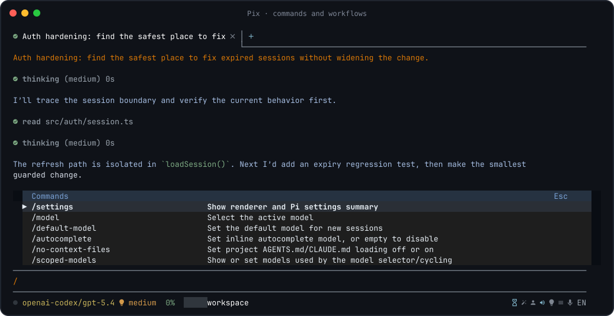
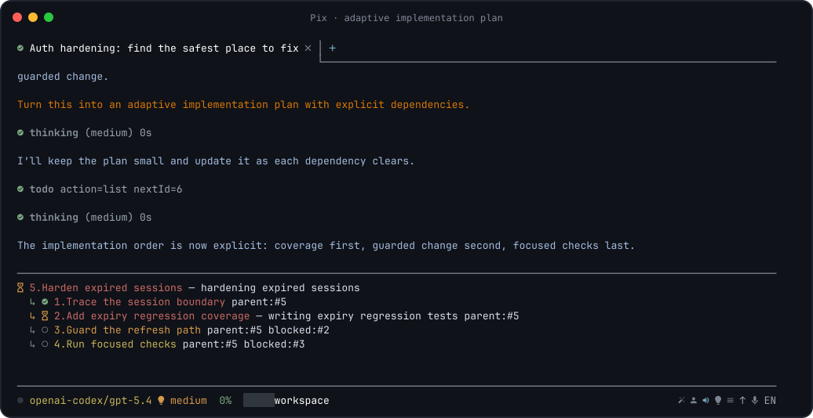
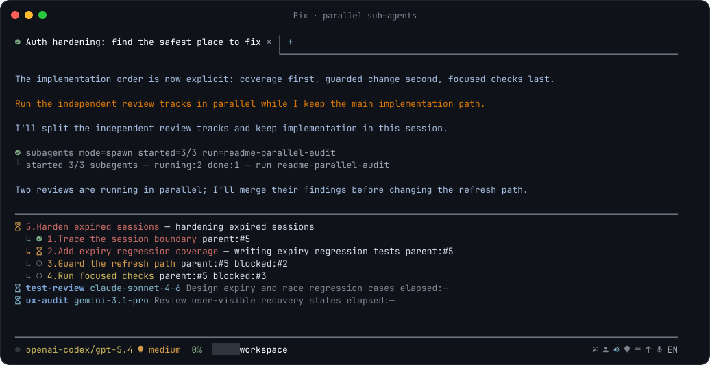

# Using Pix TUI

<!-- markdownlint-disable MD013 -->

Pix TUI is a workspace-first renderer for Pi. It keeps the Pi SDK runtime,
session format, extensions, skills, prompts and tools, while adding a renderer
designed for long tool-heavy coding sessions.

For the native application, see [Pix Desktop](desktop.md).

## Workspace model

- Persistent tabs are scoped to the current working directory.
- Session loading is lazy, so reopening a workspace does not eagerly start every
  runtime.
- Thinking/tool activity renders as compact expandable rows.
- Todos and sub-agents have dedicated structured UI.
- Markdown, code, diffs, links, images, widgets and dialogs render in the
  workspace instead of as raw terminal logs.
- Dark/light themes, model colors and Nerd Font icons are supported with
  fallbacks.



Start in a project:

```bash
pix --cwd .
```

Useful options:

```text
pix [--cwd <path>] [--no-session] [--session <path>]
    [--theme dark|light] [--model <provider/model[:thinking]>]
```

## Prompt workflow

- `Enter` sends the prompt.
- `Shift+Enter` inserts a newline.
- `Tab` accepts autocomplete or the selected popup.
- `/enhance` improves the current draft with the configured helper model.
- `/queue <message>` stores a delayed message.
- `/history` searches prompt history.

Type `/` to open the searchable command picker. Extensions can contribute
additional commands.

## Local shell

```text
!git status
!npm test
!!npm run dev
!!python
```

- `!command` runs a shell command and renders the result as local UI activity;
  it is not written to the Pi session.
- While it runs, editor input can be sent to stdin and `Ctrl-C` interrupts it.
- `!!command` opens or activates the Desktop **Terminal** workbench tab and
  starts a raw interactive terminal there for REPLs, TUIs, debuggers and
  development servers.

## Git helpers

- `/code-review` reviews staged, unstaged and untracked changes with the
  configured review model.
- `/commit-message` generates a message from the staged diff and asks before
  committing.

`/commit-message` never stages changes or bypasses Git hooks. If the staged
diff changes before confirmation, Pix refuses the commit and asks for a fresh
message.

## Images, clipboard and files

- Paste clipboard images with `Ctrl+V` / `Cmd+V` in supported terminals.
- File/image references can be added to prompts.
- Detected file links in output are actionable.
- `/copy` copies the last assistant message.

Linux clipboard integration uses native support when available and common
Wayland/X11 helpers otherwise (`wl-clipboard`, `xclip`, `xsel`).

## Sessions and tabs

Pix persists a tab workspace per project. Reopening the same `--cwd` restores
tabs, active tab, drafts, queued messages and session references.

Common commands:

- `/new_tab` — fresh session in another tab;
- `/resume` — session picker or explicit path;
- `/search` — search session contents and open a match;
- `/fork`, `/clone`, `/tree`, `/jump` — branch/navigation workflows;
- `/export` / `/import` — move sessions through HTML/JSONL;
- `/share` — publish a secret GitHub gist;
- `/compact` — manually summarize older context;
- `/delete` — permanently delete a session after confirmation.

`maxProjectSessions` controls automatic per-project session retention; `0`
keeps sessions indefinitely.

## Bundled pi-tools-suite

Pix links the bundled suite into the active Pi agent directory when safe. An
existing non-symlink installation is preserved.

Major capabilities include:

| Area | Modules / behavior |
| --- | --- |
| Parallel work | `async-subagents`, presets, fallback routing, `/ultrawork`, `/hyperplan` |
| Repository intelligence | indexed architecture/structure/AST/semantic/symbol/dependency tools |
| Structural edits | `ast-grep` |
| Feedback | LSP diagnostics and comment checks |
| Planning | hierarchical durable todos |
| Context | DCP compression/pruning and context gateway tools |
| Web | local/cloud web-search integrations |
| Providers | usage, Antigravity auth, OpenCode credential import |
| Reusable resources | prompt commands, Git-backed Registry, session naming |
| Recovery | bounded session overview/search/section tools |
| Payload hygiene | truncation normalization and opt-in credential firewall |

Optional modules activate only when their host requirements are available.

Adaptive plans keep dependencies, blockers, ownership and the active step
visible:



Parallel sub-agents report live status without taking over the main session:



Useful suite commands include `/todos`, `/sub-status`, `/sub-stop`,
`/ultrawork`, `/hyperplan`, `/usage`, `/dcp`, `/idx-init`,
`/idx-update`, `/opencode-import`, `/antigravity-add-account`, and
`/registry`.

## Command map

| Area | Commands |
| --- | --- |
| Renderer/resources | `/settings`, `/hotkeys`, `/reload`, `/changelog`, `/update` |
| Models | `/model`, `/default-model`, `/scoped-models`, `/thinking`, `/default-thinking`, `/autocomplete` |
| Project context | `/no-context-files`, `/compact` |
| Prompt workflow | `/enhance`, `/queue`, `/copy` |
| Git | `/code-review`, `/commit-message` |
| Sessions | `/new`, `/new_tab`, `/resume`, `/name`, `/session`, `/search`, `/history`, `/jump`, `/tree` |
| Branching/files | `/fork`, `/clone`, `/delete`, `/export`, `/import`, `/share` |
| Status/process | `/usage`, `/quit`, `/exit` |

Use `/hotkeys` and the live `/` picker as the authoritative command/key
summary for the installed version.

## Workspace undo

Pix records supported agent file mutations against the user message that started
them. Use the message action **Undo changes** to rewind that branch and restore
recorded workspace changes.

Workspace undo is a safety net, not a replacement for version control.
